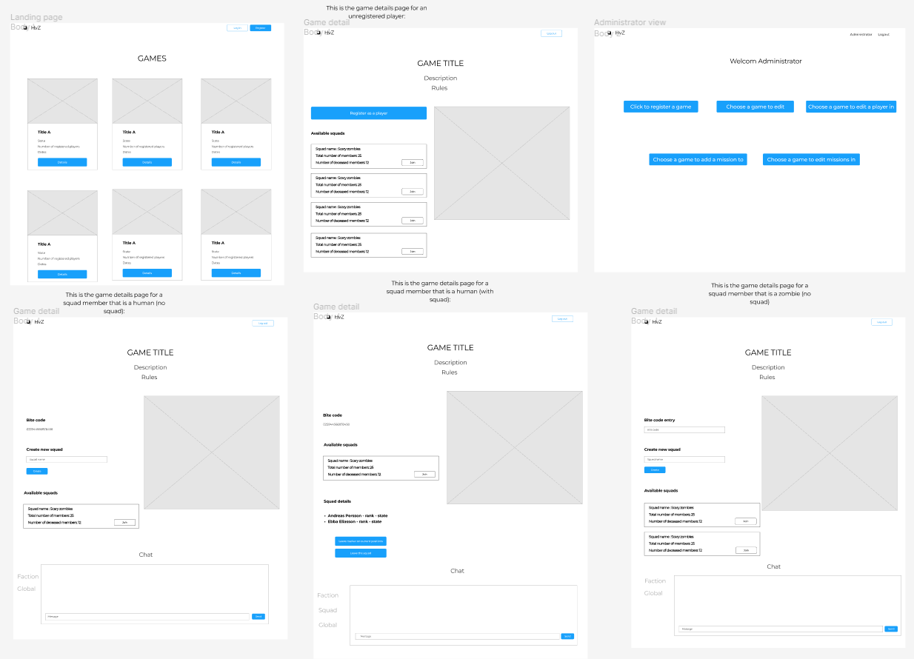

# Human Vs Zombies

This project is generated with React Javascript, React and Bootstrap. HumansVsZombies is a game where all players start as a human, and an original zombie will be randomly selected. The Original Zombie tags a human player and then a human turn into zombies. In each game there is the possibility to select a squad, join a game and create a squad. 

## Table of Contents

- [Installation](#installation)
- [Visuals](#visuals)
- [Contributors](#contributors)
- [Project status](#project-status)

## Website-link

https://humansvszombiesapp.herokuapp.com/

## Installation

      Install Visual Studio Code. 
      Git clone RebeckaOcampoSandgren/HumansVsZombies-Frontend 
      cd humansvszombies 
      npm install  
      npm start 


## Visuals

Design of the application pages without design details in the planing process, drawn in Figma.




#### Landing page ("/")

Landing page has:
- Game List: A list of all games. Each game card displays the game title, the current game state and number of registered players.
- Login button: By logging in as a user or an administrator or create a new account you will see more details in landing page. When logged in a  ``` Details ``` button will show in each game card. 
- Administrator link: By logging in as an administrator you will see ```administrator``` link in the navbar which redirect you to the  Administration page. 
- Logout button: Logout button will appears to give the user opportunity to logging out. This button redirect the user to the landing page.


#### Game details page ("/gamedetails")

- Title: The name, description and rules of the game will be displayed to any user. 
- Map: An interactive map of the game area that contains gravestones and mission markers.
- Register to game: A button that allows a user to register as a player in the game.
- Bite Code: Human players will have a unique bite code. The bite codes should be randomly generated.
- Bite Code Entry: Zombies have to write the tagged humans' bite code to the entry to turn the human player into a zombie. 
- Squad List: Alist of available squads in each game and a join button for players to join that squad. Each squad in the list displays the squad name, respective total number of members, number of “deceased” members.
- Squad Creation: A player can create a new squad in a game.
- Squad Details: This displays the names, ranks and state of each of the squad members of the squad that player is joined. 
-  Chat box: A simple layout of chatbox to give a player opportunity to communicate to other players.

#### Administration page ("/AdministrationPageView")

As an administrator you have some extra opportunities that a user does not have. The administrator can:
•  Create a game.
•  Edit a game.
•  Edit player’s state. 
•  Create mission markers in a game. 
•  Edit mission markers in a game. 

To be able to try administrator page and its functionality login with: 
Username: admin
Password: admin


## Contributors

Rebecka Ocampo Sandgren - @rebsan00003 

Negin Bakhtiarirad - @neginb 

Betiel Yohannes - @betielyohannes 

Fadi Akkaoui - @FadiAkkaoui

## Project status

The minimal Viable Product for the assignmement works. 

Features to add: 
•  Functionality to chat in real-time 
•  Leave a squad 
•  Show the squad details
•  Functionality for players to register a kill

## Tech-stack 

Code editor: Visual studio code

React - Quick Start

Bootstrap // React

Heroku 
